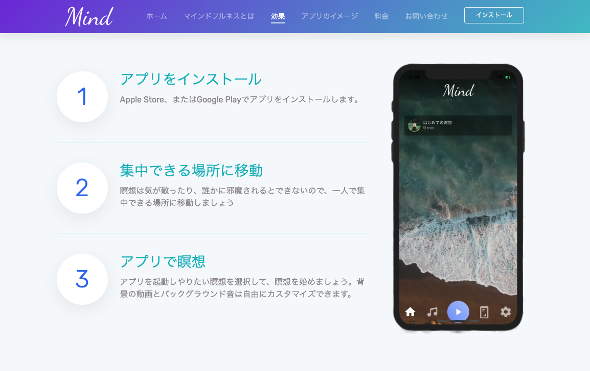

# mind-app 

## 開発環境

react native ( expo )

firebase storage




## LP

リポジトリ: https://github.com/seiyatakahashi/mind_website_add_cast

URL: https://mind-productbank.firebaseapp.com/


## 環境構築

```
git clone https://github.com/seiyatakahashi/mind-app.git
cd mind-app
brew install npm
brew install yarn
sudo yarn
yarn start
```


## LICENSE

MIT